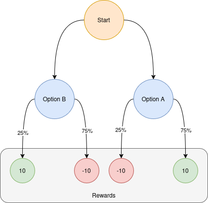
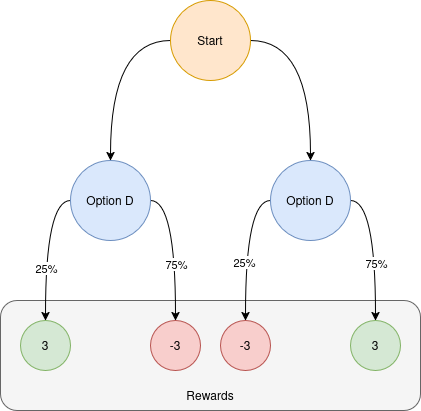

# 1. Maze

This project implements a reinforcement learning (RL) environment and training pipeline for a 3D maze navigation task. The environment simulates a maze where an agent must learn to navigate and make decisions, such as choosing between doors with different reward probabilities.

The project leverages PyTorch, TorchRL, and custom environment wrappers to enable scalable, parallelized training using the Proximal Policy Optimization (PPO) algorithm. The training process includes data collection, advantage estimation, policy/value updates, checkpointing, and visualization of learning progress.

## 1.1. Table of Contents

- [1. Maze](#1-maze)
  - [1.1. Table of Contents](#11-table-of-contents)
  - [1.2. Methodology](#12-methodology)
    - [1.2.1. Environment](#121-environment)
    - [1.2.2. Training](#122-training)
    - [1.2.3. Testing](#123-testing)
  - [1.3. Features](#13-features)
  - [1.4. Conclusions](#14-conclusions)
    - [1.4.1. Reward systems](#141-reward-systems)
    - [1.4.2. Control systems](#142-control-systems)
    - [1.4.3. Data](#143-data)
    - [1.4.4. Interpretations](#144-interpretations)
  - [1.5. Contributors](#15-contributors)
  - [1.6. License](#16-license)
- [2. Citations](#2-citations)

## 1.2. Methodology

The project is a more complex implementation of two-armed Bandit Problem, in search of how RL agents would react to CNN models. In our implementation we are searching for the following data:

1. How will the AI learn compared to one-hot encoding linear NN?
2. How will the AI learn in a 3D space?
3. Will the AI be able to learn from 2 different sets of rewards?
4. How will the AI respond to changes in the environment?

### 1.2.1. Environment

To accomplish this goals, we created a simplified environment, that had the following architecture:

The AI would be faced with a possible left or right door, and A and B are represented with an 'X' and '+' sign accordingly. Once the model would enter a door, the environment would make a decision to give a +- 10 reward, depending on the probability.

The same fixture was made for a different set of doors, representing C and D doors. They where represented by a box and diamond symbol. However, the reward was +-3, instead of the AB's 10

There was also a 25% chance of the probabilities getting flipped, this was represented by having the symbols appear in a RED color.

### 1.2.2. Training

The AI would be tested by presenting 2 doors in a random order, of either AB or CD pairs. The AI is then placed in control of a character that must move front back, left or right, and can look to the left and right, giving a total of 6 possible movements. The Environment would then give a positive reward if the door had gold and the agent crossed the door, and would give a negative reward if the door had an empty room. 

The environment also returned the current image, and then wait for a next set of inputs to update positions. 

The initial reward system was based on the following parameters:

- Has ended? return final reward (defined by the door entered)
- Is not making any moves? subtract a given amount
- Is close to a door? reward a little bit
- Crossed a door? give a reward of 1

However, during training, reward engineering was used, and different rules where used. (see conclusions)

### 1.2.3. Testing

Once the model is trained, the same scenarios where tested, and graphed. However, once AB and CD pairs where finished, a comparison in behavior of AC (both positive rewards) and BD (both expected to be negative rewards) are to be matched, and tested. After those tests, AD are tested, and BC are tested, to know how the agent would react. 

Data would be gathered and then processed.

## 1.3. Features

-   Custom 3D Maze Environment:

    The environment provides a 3D maze with interactive elements (doors, rewards) and supports both single and batched/multithreaded execution for efficient RL training.

-   TorchRL Integration:

    The environment is wrapped as a TorchRL-compatible class, enabling seamless use with TorchRL's data collectors, transforms, and utilities.

-   PPO Training Pipeline:

    The notebook implements a full PPO training loop, including:

    -   Parallel data collection with SyncDataCollector
    -   Advantage estimation using Generalized Advantage Estimation (GAE)
    -   Policy and value updates with gradient clipping and learning rate scheduling
    -   Periodic evaluation and checkpointing

-   Custom CNN Policy:

    A convolutional neural network is used as the policy and value function, processing visual observations from the environment.

-   Logging and Visualization:

    Training and evaluation metrics are logged and visualized live using matplotlib. Feature maps from the CNN can be visualized with TensorBoard.

-   Flexible Hyperparameters:

    The notebook exposes hyperparameters for environment size, batch size, learning rate, PPO settings, and more, allowing for easy experimentation.

-   Checkpointing and Model Reloading:

    The training process saves checkpoints and logs, and supports loading trained models for further evaluation or visualization.

## 1.4. Conclusions

### 1.4.1. Reward systems

During our testing, we found the following:

-   If you give it a reward for entering the door that is too big, the agent enters any door without caring at all
-   If you give it a reward for getting close to the door, the agent will learn to get close to the door, but not necessarily enter it.
-   If you give it the same reward for entering the good room as the bad reward for entering the bad room, the agent will learn to not risk it and does not enter any door.
-   If you give it a negative reward for not entering doors, it learns to not enter *any* door, and tries to instead reach a local max (IE, just move around).

### 1.4.2. Control systems

At first, we used a Bernoulli control over the agent, however, we changed it to a Categorical.

-   Categorical is faster and can speed up training and improve model performance.

Other foundings where:

-   Smaller effective action space

> Bernoulli: 2⁶=64 possible combinations of button‐press subsets. Most of those (e.g. pressing forwards and backwards simultaneously) are equivalent or ignored, but the agent still has to explore them.  
> Categorical: exactly 6 valid one-hot choices. That’s 6 states, not 64. Much easier to explore and assign credit.

-   Lower gradient variance

> With a 6-class softmax, you get one log‐prob gradient per step.  
> With 6 independent Bernoullis, you get 6 separate log‐probs (and effectively six “yes/no” learning signals), which adds noise to PPO’s gradient estimate.

-   Simpler entropy bonus & tuning

> A single entropy coefficient on a 6-way categorical is straightforward.  
> With Bernoulli you’d need to balance 6 separate entropy terms (or one shared coefficient), making exploration/exploitation trade-offs trickier.

### 1.4.3. Data

### 1.4.4. Interpretations

By having an interactive environment, a 3rd possibility arises to a 2-way bandit... Not taking any chances at all. The model tends to prefer not risking anything and staying neutral, to actually risking a reward. It is something it learns very early on, and continues as training progresses. 

This exact scenario is seen in gambling rooms, where people are more likely to stop after a loss, and after a series of losses, the model does not try to take a door anymore (2022,  Winning and losing in online gambling). If the model is "Lucky" at the beginning, it tries to open doors, until bad luck appears, and the model prefers a neutral reward.

## 1.5. Contributors

-   Mario Ignacio Frias Piña (https://github.com/MarioFriasPina)
-   Alejandro Fernández del Valle Herrera (https://github.com/MrDrHax)
-   Oswaldo Ilhuicatzi Mendizábal (https://github.com/OswaldoMen14)

## 1.6. License

This project is licensed under the [MIT License](LICENSE).

# 2. Citations

Chen, Z., Doekemeijer, R. A., Noël, X., & Verbruggen, F. (2022). Winning and losing in online gambling: Effects on within-session chasing. Plos One, 17(8), e0273359.  